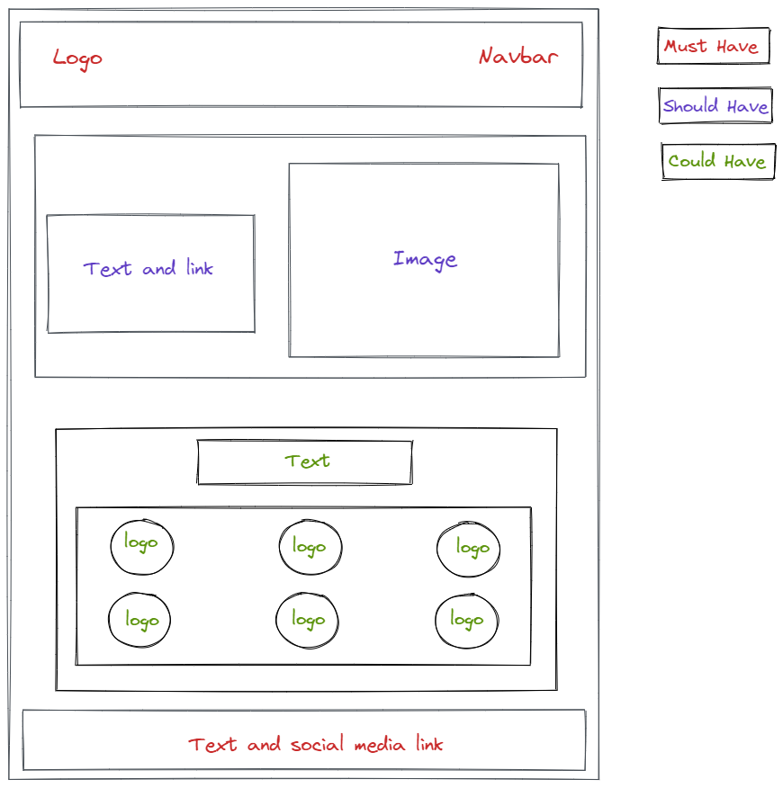

# Anita's Home Page

<!-- introduce your interviewee -->

## Steps

- [Anita's Home Page](#anitas-home-page)
  - [Steps](#steps)
  - [1. First Interview](#1-first-interview)
    - [Notes](#notes)
    - [Summary](#summary)
  - [2. Follow-Up Interview](#2-follow-up-interview)
    - [Notes](#notes-1)
    - [Summary](#summary-1)
  - [3. Capture Findings](#3-capture-findings)
    - [Needs](#needs)
    - [Insights](#insights)
  - [4. Define the Problem](#4-define-the-problem)
  - [5. Open-Ended Ideation](#5-open-ended-ideation)
  - [6. Partner Feedback](#6-partner-feedback)
    - [Notes](#notes-2)
    - [Summary](#summary-2)
  - [7. Plan](#7-plan)
  - [8. Design](#8-design)
  - [9. Final Feedback](#9-final-feedback)
    - [Notes](#notes-3)
    - [Summary](#summary-3)

---

## 1. First Interview

<!--
  Take some time getting to know your partner and their ambitions. Ask questions about:

  - Their background (Professional, programming, personal)
  - Their ambitions (Professional, programming, personal)
  - Outside interests (For tying into a personal statement)
  - And much more ... listen to your partner and ask questions about what they tell you.

  The best way to do your interview is with a lot of `why?`.
  Try to always use their answer in your next question, this makes sure you understand what they said.

  Start your interview with one or two open-ended questions and follow up with a lot of `why?`, this gives your partner the chance to really explain themselves instead of just answering your questions. You might find that they even learn something about themselves!
-->

### Notes

<!-- Notes you took during the interview. -->

- Anita Sharma, age 31, is a junior front-end developer and IT professional
- She is a job seeker
- She doesn't have a website to show her skills and experience

### Summary

She wants to create a portfolio website so that the employers and the recruiters
can see her profile.

<!-- Consolidate your notes into a few sentences. Do your best to express what your partner was trying to say, not what you learned from them. -->

---

## 2. Follow-Up Interview

<!--
  In this follow up interview you will present to your partner a summary of your first interview. You will do your best effort to understand, rephrase, and communicate your partners needs back to them. Take this chance to listen for their feedback on how well you understand their situation. Update your notes accordingly
-->

### Notes

Anita wants to have a nice portfolio look

### Summary

- the website she expects should be unique and has a nice look
- it must have light colors
- And, it will be in English

---

## 3. Capture Findings

<!-- Take some time to consolidate & summarize what you learned in the previous two interviews. -->

### Needs

<!-- What exactly does your partner need from their home page? Are they looking for collaborators? A job?Learning opportunities? Or something you never expected? -->

Anita wants to develop her personal website that is attractive for the targeted
visitors

### Insights

She wants to have an interesting portfolio website in English

<!-- New learnings about your partner to use in your design -->

---

## 4. Define the Problem

<!--
  In your own words describe:

  - Why does your partner need this home page?
  - How do they want to be represented?
  - Who do they want to visit their page?
  - What do they want different visitors to see them?

  A useful format:

  - _partner's name_ needs a way to _?_.
    - Unexpectedly, in their world, _?_.
-->

Anita wants to demonstrate her skills and experience to the job recruiters

---

## 5. Open-Ended Ideation

<!--
  Sketch up a few wireframes for your partner's home page with no regard for your their programming ability, time constraints, technical constraints, or any other practical considerations.
  How are the designs different? How does each one serve your partner differently?
-->

---

## 6. Partner Feedback

<!-- Discuss your ideas with your partner. lots of `why?`. -->

### Notes

### Summary

---

## 7. Plan

<!-- With your partner, come up with a Backlog and Wireframe for their Home page -->

---

## 8. Design

<!-- Propose an Atomic Design for your partner's home page. This could include a color palate, button designs, icons, ... -->

---

## 9. Final Feedback

<!--
  The Design Process is never finished!

  After you've finished the Plan & Design ask your partner for feedback. In a professional setting this would be the beginning of a whole new development cycle.
-->

### Notes

### Summary

---

---

This template is inspired by
[the wallet project](https://dschool-old.stanford.edu/sandbox/groups/designresources/wiki/4dbb2/attachments/e1005/TheWalletProjectB%26W2012.pdf?sessionID=8af88fee76ecd1fb7879c915073461486c425622)
[pdf](https://hci.stanford.edu/dschool/resources/wallet/Wallet%20Facilitators%20Guide.pdf)
